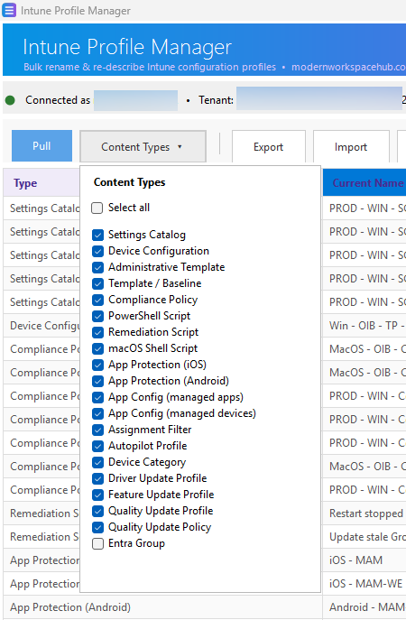

# Intune Profile Bulk Renamer Tool

[](https://www.powershellgallery.com/packages/Invoke-IntuneProfileManager)
[](https://www.powershellgallery.com/packages/Invoke-IntuneProfileManager)
[](LICENSE)

A self-contained **PowerShell 7 + Windows Forms** desktop tool for **bulk renaming and re-describing Microsoft Intune configuration profiles** via the Microsoft Graph API.

Pull every configuration profile from your tenant into an editable grid, change the **display name** and/or **description** — inline, in Excel, or with built-in find & replace — and write the changes back. Only the name and description are ever modified; nothing else about a profile is touched.

> ⚠️ A free tool by **[modernworkspacehub.com](https://modernworkspacehub.com)**. Provided **"as is", without warranty of any kind** — it modifies live data in your Intune tenant, so use at your own risk. See [Disclaimer](#disclaimer).

---

## Table of contents

- [Screenshots](#screenshots)
- [What it does](#what-it-does)
- [What it does *not* do](#what-it-does-not-do)
- [Content types covered](#content-types-covered)
- [Requirements](#requirements)
- [Permissions](#permissions)
- [Install](#install)
- [Usage](#usage)
- [CSV format](#csv-format)
- [Find & Replace](#find--replace)
- [Backups & restore](#backups--restore)
- [Logs](#logs)
- [Safety notes](#safety-notes)
- [Troubleshooting](#troubleshooting)
- [Changelog](#changelog)
- [Disclaimer](#disclaimer)

---

## Screenshots

<!--
  Add your screenshots here. Drop the image files into a `docs/` folder in the repo
  and update the paths below. Suggested shots: the main window with profiles loaded,
  the Content Types picker, and Find & Replace.
-->





<!-- Optional extra shot, e.g. a dry-run / apply result in the activity log:

-->

---

## What it does

- **Connects to Microsoft Graph** interactively using the Microsoft Graph PowerShell SDK.
- **Pulls many Intune content types** — not just configuration profiles, but compliance policies, app protection/configuration policies, scripts, remediations, filters, Autopilot profiles, update rings/profiles, and more (see [Content types covered](#content-types-covered)).
- **Content Types picker** — a dropdown checklist (with *Select all*) to choose exactly which content types the next **Pull** fetches.
- **Shows the specific template kind** for Device Configuration in the Type column, e.g. `Device Configuration (VPN)`, `(SCEP certificate)`, `(Domain join)`, `(Wi-Fi)`.
- **Edits inline** — change *New Name* / *New Description* directly in the grid; changed cells are highlighted.
- **Exports to CSV** for bulk editing in Excel, then **imports the CSV back** in.
- **Find & Replace** across names/descriptions — literal or regex, with a one-click "strip trailing version" preset (e.g. removing ` v3.9`, `-2.8`).
- **Dry-run mode** previews exactly what would change without calling Graph.
- **JSON backup & restore** — snapshot current names/descriptions and revert if needed (an automatic safety backup is also taken before every apply).
- **Applies changes** by sending a minimal `PATCH` to the correct Graph endpoint for **only the rows that changed**.
- **Logs everything** to a real-time activity log and a daily log file in the repo.

## What it does *not* do

- ❌ Does **not** change anything other than **display name** and **description**. Settings, assignments, scope tags, platform, payloads, etc. are never modified.
- ❌ Does **not** create, delete, duplicate, or assign anything.
- ❌ Does **not** touch the *settings/content* of an item — it is a name/description editor only.
- ❌ Does **not** support app-only/unattended authentication — sign-in is interactive (delegated).
- ❌ Is **not** a Microsoft product and is **not** supported by Microsoft.

## Content types covered

All endpoints use Microsoft Graph **beta** (except Entra groups, which use `v1.0`), so every derived template type is surfaced. Pick which to pull in the **Content Types** dropdown — everything is selected by default **except Entra groups** (opt-in, because renaming directory groups is high-impact).

| Content type | Graph collection |
|---|---|
| **Settings Catalog** | `deviceManagement/configurationPolicies` |
| **Device Configuration** *(all templates — device restrictions, domain join, Wi-Fi, VPN, SCEP/PKCS/trusted certs, health monitoring, kiosk, email, custom OMA-URI, …)* | `deviceManagement/deviceConfigurations` |
| **Administrative Template** | `deviceManagement/groupPolicyConfigurations` |
| **Template / Baseline** *(endpoint security & security baselines)* | `deviceManagement/intents` |
| **Compliance Policy** | `deviceManagement/deviceCompliancePolicies` |
| **PowerShell Script** | `deviceManagement/deviceManagementScripts` |
| **Remediation Script** | `deviceManagement/deviceHealthScripts` |
| **macOS Shell Script** | `deviceManagement/deviceShellScripts` |
| **App Protection (iOS / Android)** | `deviceAppManagement/iosManagedAppProtections`, `androidManagedAppProtections` |
| **App Config (managed apps / managed devices)** | `deviceAppManagement/targetedManagedAppConfigurations`, `mobileAppConfigurations` |
| **Assignment Filter** | `deviceManagement/assignmentFilters` |
| **Autopilot Profile** | `deviceManagement/windowsAutopilotDeploymentProfiles` |
| **Device Category** | `deviceManagement/deviceCategories` |
| **Driver / Feature / Quality Update Profiles** | `deviceManagement/windows{Driver,Feature,Quality}UpdateProfiles` |
| **Quality Update Policy** | `deviceManagement/windowsQualityUpdatePolicies` |
| **Entra Group** *(opt-in)* | `groups` |

> The catalogue is data-driven and easy to extend — each type is one row in the `$ContentTypes` table in the script (endpoint, name property, and whether its PATCH needs an `@odata.type`).

## Requirements

- **Windows** (the UI is built on Windows Forms).
- **PowerShell 7+** (`pwsh.exe`). It will refuse to run on Windows PowerShell 5.1.
- **Microsoft Graph PowerShell SDK** — only the authentication module is required:
  ```powershell
  Install-Module Microsoft.Graph.Authentication -Scope CurrentUser
  ```
- An Intune-licensed Entra ID tenant and an account with sufficient permissions (below).
- No other third-party dependencies.

## Permissions

The tool requests these **delegated** Graph scopes at sign-in (covering all content types):

| Scope | Used for |
|---|---|
| `DeviceManagementConfiguration.ReadWrite.All` | Config & compliance policies, admin templates, baselines, filters, update profiles |
| `DeviceManagementScripts.ReadWrite.All` | PowerShell / remediation / macOS shell scripts *(required since 31 Jul 2025)* |
| `DeviceManagementApps.ReadWrite.All` | App protection & app configuration policies |
| `DeviceManagementServiceConfig.ReadWrite.All` | Autopilot profiles, enrollment configurations |
| `Group.ReadWrite.All` | Entra ID groups *(only used if you opt that type in)* |

- An admin must **consent** to these the first time (or pre-consent them in Entra ID).
- **Directory role:** typically **Intune Administrator** (or a custom role with the equivalent read/update rights). Global Administrator works but isn't required. Renaming Entra groups additionally needs group-write rights.
- **Partial consent is fine** — if a scope isn't granted, the content types that need it are simply skipped (logged as a warning) rather than failing the whole pull.

## Install

### Option A — PowerShell Gallery (recommended)

Published as a script on the [PowerShell Gallery](https://www.powershellgallery.com/packages/Invoke-IntuneProfileManager):

```powershell
# Install the prerequisite Graph module (one-off)
Install-Module Microsoft.Graph.Authentication -Scope CurrentUser

# Install the tool
Install-Script -Name Invoke-IntuneProfileManager -Scope CurrentUser

# Run it (from PowerShell 7)
Invoke-IntuneProfileManager.ps1
```

Update later with `Update-Script -Name Invoke-IntuneProfileManager`.

> `Install-Script` saves to your user scripts folder (which is on `PATH`), so you can launch it by name. If the name isn't found, run it with its full path or `& "$(Split-Path (Get-InstalledScript Invoke-IntuneProfileManager).InstalledLocation)\Invoke-IntuneProfileManager.ps1"`.

### Option B — Download / clone

1. Install the prerequisite module: `Install-Module Microsoft.Graph.Authentication -Scope CurrentUser`.
2. Download or clone this repository.
3. Run the script from **PowerShell 7**:

   ```powershell
   pwsh .\Invoke-IntuneProfileManager.ps1
   ```

   > Tip: launch from a fresh `pwsh` window for best results.

The script is a single self-contained `.ps1` file. It creates `Logs\` and `Backups\` folders next to itself on first run.

## Usage

1. **Connect** — click **Connect to Intune** and sign in. The status bar shows the connected account and tenant.
2. **(Optional) Content Types** — click **Content Types** and tick which types to pull (all on by default except Entra groups). Use *Select all* to toggle everything.
3. **Pull** — click **Pull** to load the selected content types into the grid.
4. **Edit** — change values in the **New Name** / **New Description** columns. Changed cells are highlighted amber. You can:
   - Edit directly in the grid, **or**
   - **Export** to CSV, edit in Excel, then **Import** the CSV back, **or**
   - Use **Find/Replace** for bulk changes (see below).
5. **(Optional) Backup** — click **Backup** to save a JSON snapshot you can restore later.
6. **(Optional) Dry run** — tick **Dry run** to preview what would change without writing anything.
7. **Apply** — click **Apply**. You'll be asked to confirm. Only rows where the name or description differs from the current value are sent to Graph; each result is logged. (A safety backup is written automatically before any real apply.)

> Toolbar buttons have tooltips describing each action.

## CSV format

Export/import uses these columns:

| Column | Editable | Purpose |
|---|---|---|
| `ProfileId` | No | Graph object ID (do not change) |
| `ProfileType` | No | Profile family/template kind (used to route the update) |
| `CurrentName` | No | Current display name (for reference/diffing) |
| `NewName` | **Yes** | The new display name to apply |
| `CurrentDescription` | No | Current description (for reference/diffing) |
| `NewDescription` | **Yes** | The new description to apply |

Edit only the **NewName** and **NewDescription** columns. On import, rows are validated; malformed or unrecognised rows are skipped and reported in the log. A change is applied only where a New value differs from its Current value.

## Find & Replace

Operates on the **New Name** / **New Description** columns in the grid (nothing is sent to Intune until you Apply):

- **Literal** or **regular expression** matching, with an optional case-sensitive toggle.
- Target **New Name**, **New Description**, or both.
- Scope to **all rows** or **selected rows only**.
- Leave **Replace with** blank to **delete** the matched text.
- **Preview** counts matches before committing.
- **Strip trailing version** preset removes a trailing version postfix such as ` v3.9`, ` 3.1`, `-2.8`, `V10.0.1` (regex: `[\s_\-]*[vV]?\d+(\.\d+)+\s*$`). Tweak it or write your own afterwards.

## Backups & restore

- **Backup** writes a timestamped JSON snapshot of the current names and descriptions to `Backups\`.
- An **automatic** snapshot (`*_auto-preapply.json`) is written before every non-dry-run apply.
- **Restore** reads a backup and writes the saved names/descriptions back to Intune (respects Dry run, with confirmation and per-profile logging).

## Logs

- A live **Activity Log** is shown in the app.
- Everything is also appended to a daily file: `Logs\IntuneProfileManager_yyyyMMdd.log`.

## Safety notes

- **Always run a Dry run first** on a large batch, and/or take a **Backup**, before applying.
- Renames change how profiles appear in the Intune portal and any reporting that keys off display name — coordinate with your team before bulk renaming.
- The tool never blanks a name: rows with an empty **New Name** are skipped.
- Test against a small selection (or a non-production tenant) before running tenant-wide.

## Troubleshooting

| Symptom | Likely cause / fix |
|---|---|
| "This tool requires PowerShell 7" | You launched it in Windows PowerShell 5.1. Use `pwsh.exe`. |
| "Microsoft Graph SDK not found" | Run `Install-Module Microsoft.Graph.Authentication -Scope CurrentUser`. |
| A content type is missing after Pull | It wasn't ticked in **Content Types**, or your role/consent lacks the scope for it — check the log for a skipped/permission warning. |
| `403 / Forbidden` on apply | Missing consent or insufficient role for the relevant scope (see [Permissions](#permissions)). |
| `404 / NotFound` on apply | The item was deleted since the last pull — Pull again. |
| Entra groups won't rename | Synced (on-prem) groups are read-only in Entra, and renaming groups needs `Group.ReadWrite.All` consent. |

## Changelog

This project follows [Semantic Versioning](https://semver.org/). The version is set in the script's `PSScriptInfo` block and on the [PowerShell Gallery](https://www.powershellgallery.com/packages/Invoke-IntuneProfileManager).

### 1.1.0

- **Many more content types** — beyond configuration profiles, the tool now covers compliance policies, app protection (iOS/Android), app configuration (managed apps/devices), PowerShell/remediation/macOS shell scripts, assignment filters, Autopilot profiles, device categories, driver/feature/quality update profiles & policies, and (opt-in) Entra groups.
- **Content Types picker** — a dropdown checklist (with *Select all*) to choose exactly which content types each Pull fetches.
- **Expanded Graph scopes** to cover the new types, with graceful skip-on-missing-consent.
- **Fix:** Content Types selection now persists correctly to the Pull action.

### 1.0.0

- Initial release. Bulk rename & re-describe Intune configuration profiles (Settings Catalog, Device Configuration templates, Administrative Templates, security baselines/intents).
- Editable grid, CSV import/export, Find & Replace (literal/regex + strip-trailing-version preset), JSON backup & restore, dry-run mode, daily file logging, and a generated app icon.

## Disclaimer

This tool is provided **"as is", without warranty of any kind**, express or implied, including but not limited to the warranties of merchantability, fitness for a particular purpose, and non-infringement. In no event shall the author or modernworkspacehub.com be liable for any claim, damages, or other liability arising from the use of this tool.

**It modifies live data in your Microsoft Intune tenant. Use at your own risk.** You are responsible for testing it and for any changes it makes. This project is not affiliated with, endorsed by, or supported by Microsoft.

---

*Made by [modernworkspacehub.com](https://modernworkspacehub.com). Part of the same toolset as [Win32Forge](https://github.com/durrante/Win32Forge) — upload, automate & document Win32 apps in Intune.*
